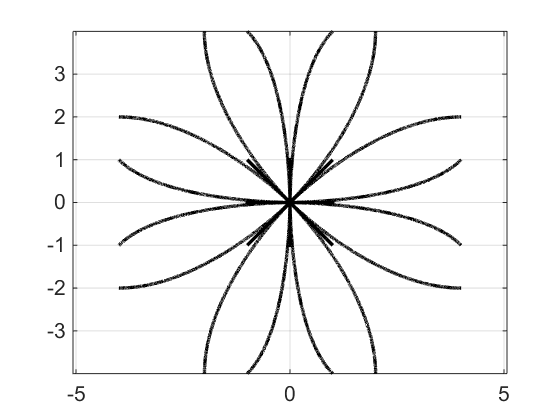

# [Документация на русском](README-RU.md)
# CBS--PrioritizedPlanning--MP
This project contains implementations of different algorithms designed for the multiagent pathfinding problem. Namely, following algorithms with some of their modifications are implemented: [Conflict based search](https://www.aaai.org/ocs/index.php/AAAI/AAAI12/paper/viewFile/5062/5239), [Enhanced conflict based search](https://www.aaai.org/ocs/index.php/SOCS/SOCS14/paper/viewFile/8911/8875). In all algorithms the motion primitives model of agents movements is used.

## Build and run

The project can be built with cmake using CMakeLists.txt file provided in repository. Also the project can be opened and built in Qt Creator using PathPlanning.pro file.

Input of the programm consists of several XML files: one main file and one or more additional files. Name of the main input file is passed through the first command line argument. This file contains the description of an environement and an algorithm and links for the additional input files with agents’ description. Output of the program is also saved in the XML file. Examples of input and output files are provided in `Examples` directory.

## Input data

The main file contains two sections `map` and `options`:

### Section `map` - map definition. Contains following tags:
- grid - contains attributes `width` and `height` specifing dimensions of the map. Map description is provided in the tag body, 0 means a traversable cell and 1 means an obstacle. Each row is included into `row` tag, number of rows must be equal to the `height` value and number of digits in every row must be equal to the `width` value.

### Section `algorithm` - definition of the algorihm parameters. Contains following tags:
- planner - algorithm to be used. Can take following values:
    1. cbs - Conflict based search
    2. ecbs - Enhanced conflict based search. In the high level search secondary heuristic h3 from the [article](https://www.aaai.org/ocs/index.php/SOCS/SOCS14/paper/viewFile/8911/8875) is used. Low level search depends on the low_level option
- low_level - algorithm, applied in the low level search in CBS and ECBS algorithms. Can take following values:
    1. astar - algorithm [A*](https://www.cs.auckland.ac.nz/courses/compsci709s2c/resources/Mike.d/astarNilsson.pdf)
    2. sipp - algorithm [SIPP](https://www.aaai.org/ocs/index.php/SOCS/SOCS14/paper/viewFile/8911/8875)
- with_perfect_h - find the shortest paths from all cells to agents goal positions to compute perfect heuristic for A* method (`true` or `false`). Optional parameter, default value is false
- with_card_conf - use cardinal conflicts (described [here](https://pdfs.semanticscholar.org/c072/38579a95c424707dbe855efba189cce68650.pdf)). Cardinal conflicts are considered in the descending order of minimal cost increase required to eliminate the conflict. If these values are equal, conflicts are considered in ascending order of their appearance time. Semi-cardinal and non-cardinal conflicts, as usual, are considred after cardinal conflicts in ascending order of their appearance time. Can be `true` or `false`. Optional parameter, default value is false

- with_bypassing - use conflict bypassing (as described [here](https://pdfs.semanticscholar.org/c072/38579a95c424707dbe855efba189cce68650.pdf)). Can be `true` or `false`. Optional parameter, default value is false
- with_cc_graph_h - compute heuristic on vertices of constraint tree in CBS, based on maximal matching in cardinal conflicts graph. Described [here](http://idm-lab.org/bib/abstracts/papers/icaps18a.pdf) as ICBS-h1 (except that in this case a weighted graph is considered with the weights of the edges equal to the minimal cost increase required to eliminate the conflict). Can be `true` or `false`. Optional parameter, default value is false

- mp_type - type of motion primitives to use. Can take following values:
    1. 2k_neigh - agents are moving on [2k neighborhood grid](https://jair.org/index.php/jair/article/download/11383/26555/) (where k equals to neigh_degree parameter) with constant speed and time of transition through an edge equals to its length. Also no rotate primitives are used and all turn are made instantly
    2. custom - primitives are taken from the file provided in the mp_file parameter

- neigh_degree - connectedness number for 2k neighborhood grid (i.e. parameter k). Integer number, greater or equal to 2. Considered for mp_type = 2k_neigh, optional parameter, default value is 2

- mp_file - name of the file with motion primitives description in the format desribed in "Primitive description" section. Required parameter for mp_type = custom

- scale - odd integer number. When scale > 1, each cell is divided into scale*scale smaller cells, and the agent is placed in the central cell. Optional parameter, default value is 1

- agent_size - radius of an agent. Double value, must be not more than 0.5 / scale (otherwise the cells occupied during the movement are computed incorrectly). Optional parameter, default value is 0.5

- time_resolution - parameter, used to tansform primitive duration to the integer number of timesteps. Time of transition through an edge equals to the product of its length and time_resolution rounded down. For example, if time_resolution = 1000, transition to the closest orthogonal neighbour takes 1000 timesteps, and transition to the closest diagonal neighbour takes 1414 timesteps.

### Section `options` - definition of the testing parameters. Contains following tags:
- agents_file - common prefix for the input files with agents’ description
- tasks_count - number of input files with agents’ description: in testing files with names of the form `agents_file-n.xml` are used for all `n` from 1 to tasks_count. Optional parameter, default value is 1
- agents_range - `min` and `max` attributes specify minimal and maximal number of agents for testing. When single_execution=`false`, number of agents is  gradually increased from `min` to `max` with the step agents_step and the algorithm is being run on corresponding subset of agent set. If algorithm fails to find the solution or runs longer then some fixed time limit, testing of current scenario terminates. Optional parameter, by default minimal number of agents is 1 and maximal is the same as number of agents in the agents file
- agents_step - incrementation step of number of agents for testing. Optional parameter, default value is 1
- maxtime - maximal running time of the algorihm in milliseconds. Optional parameter, default value is 1000
- single_execution - can be `true` or `false`. If option is set to `true`, the algorithm will be executed only once for the first agents file with the number of agents equal to `max` attribute in agents_range option. Output file format will also be different (see "Output data" section). Optional parameter, default value is false
- pointwise_output - add intermediate points into the agents paths in the output file (used for visualisation). Can be `true` or `false`, considered if single_execution = `true`. Optional parameter, default value is `true`
- time_step - interval between intermediate points in pointwise output. Integer number of timesteps, duration of which depends on the time_resolution parameter. For example, if time_resolution = 1000 and time_step = 10 there will be 100 intermediate points per one second. Optional parameter, default value is 1, considered if single_execution = `true` and pointwise_output = `true`
- aggregated_results - save separate testing results for each agents file or aggregated results over all agents files. Optional parameter, default value is true
- logpath - path to the directory, where log will be stored (optional parameter, by default log is stored to the same directory where the input file is located)
- logfilename - name of the log file (optional parameter, by default name of the log file has the form `input_file_name_log.xml` where "input_file_name.xml" is a name of the main input file)

### Files with agents’ descriptions
For each agent its own tag `agent` is provided with following attributes:
- id - agent’s id
- start_i, start_j - coordinates of agent’s start position (cells are numbered from 0, cell (0, 0) is in the left upper corner of the map, the first coordinate corresponds to the row number and the second to the column number)
- goal_i, goal_j - coordinates of agent’s goal position

### Primitive description
File contains one or more section tags. Every section corresponds to one agent orientation. Every section tag contains coeff and time_finish tags describing moving and rotation primitives. coeff tags have following attributes:
- id - primitive id
- Tf - primitive duration
- xf, yf - final position
- a1, a2, a3, a4, b1, b2, b3, b4 - coefficients, describing agent trajectory. Namely, the coordinates of the agent are cumputed as x(t) = a4t3+a3t2+a2t+a1,  y(t) = b4t3+b3t2+b2t+b1 and its orientation angle is computed as arctg(y'(t)/x'(t)) = arctg((3b3t2+2b2t+b2) / (3a3t2+2a2t+a2)
- v0, v1 - initial and final speed of an agent
- phi0, phif - initial and final orientation of an agent (in degrees)

It should be noted, that actual speed and orientation of the agent depend only on the coefficients ai and bi, while the values v0, v1, phi0 and phif are used only to check correctness of transition between the states (agent can execute the primitive only if its current orientation and speed are equal to the phi0 and v0 values in this primitive, rotates are possible only if current speed is equal 0). The time_finish tags describe rotate primitives and contain only id, Tf, phi0 and phif attributes. To simulate 2k_neigh primitives-like behaviour (speed is not considered and all rotates are made instantly) one should remove all time_finish tags, put all primitives in one section and make all v0, v1, phi0, phif values equal 0.

On the image below one can see the example of the set of motion primitives:

Description examples for this set [with turns](Examples/trajectories_moving.xml) and [without turns](Examples/trajectories_moving_no_turns.xml) are provided in the Examples directory.

## Output data
Output file contains `map` and `options` sections, similar to the input file, and also the `log` section with results of the execution. This section contains the `mapfilename` tag and several other tags depending on the value of single_execution and aggregated_results parameters.

If single_execution = `false`, aggregated_results  = `false`, one or more `results` tags are created. There is one `results` tag for each agents file containing several `result` tags for each number of agents. Every such tag has following attributes, descibing execution results for current agents file and current number of agents:

    1. agents_count - number of agents
    2. success_count - number of tests (among tasks_count input files) for which algorihm was able to find the solution in fixed time.
    3. makespan - number of time steps until the last agent stops moving (average)
    4. flowtime - total number of actions performed by each of the agents until they reach their goal positions (average)
    5. time - running time of the algorithm  (average)
    6. HL_expansions - number of high level expansions in CBS and ECBS (the size of CLOSE list at the end of the search).
    7. HL_nodes - number of high level nodes created in CBS and ECBS (the size of CLOSE list at the end of the search)
    8. LL_avg_expansions - average number of low level expansions in CBS and ECBS among all low level search executions
    9. LL_avg_nodes - average number of low level nodes created in CBS and ECBS among all low level search executions

[Example](Examples/empty_batch_full_log.xml) of output file for this mode.

If single_execution = `false`, aggregated_results  = `true`, one `results` tag with aggeregated testing results is created. As in the previous case, this tag contains several `result` tags with the same attributes for each number of agents. Tag attributes contain average values among all agent files for which algorithm was able to find the solution with current number of agents. [Example](Examples/empty_batch_aggregated_log.xml) of output file for this mode.

If single_execution=`true`, following tags are created (tag aggregated_results is not considered):
- taskfilename - name of the file with agents’ description
- summary - properties of the found solution. Contains `agents_count`, `makespan`, `flowtime`, `time`, `HL_expansions`, `HL_nodes`, `LL_avg_expansions`, `LL_avg_nodes` which are defined in the same way as stated above
- for each agent its own tag `agent` is provided with following attributes:
    - id - agent’s id
    - start.x, start.y - coordinates of agent’s start position
    - goal.x, goal.y - coordinates of agent’s goal position

  **Coordinate x corresponds to j coordinate, and y cooresponds to i coordinate.**

  This tag also includes tag `path` with `pathfound` attribute, which can be `true` or `false` depending on whether the solution was found. Tag `path` includes several `section` tags each of which corresponds to one agent’s movement. If pointwise_output = `false` one movement corresponds to whole primitive, otherwise movements between intermediate points are added. Tag contains following atributes:
    - id - section id
    - start.x, start.y - agent position before taking action
    - goal.x, goal.y - agent position after taking action
    - start.heading, goal.heading - agent heading before and after taking action (in degrees)
    - duration - duration of the action

[Example](Examples/empty_single_log.xml) of output file for this mode with pointwise_output = `false`. [Example](Examples/empty_single_log_pointwise.xml) of output file for this mode with pointwise_output = `true`.
